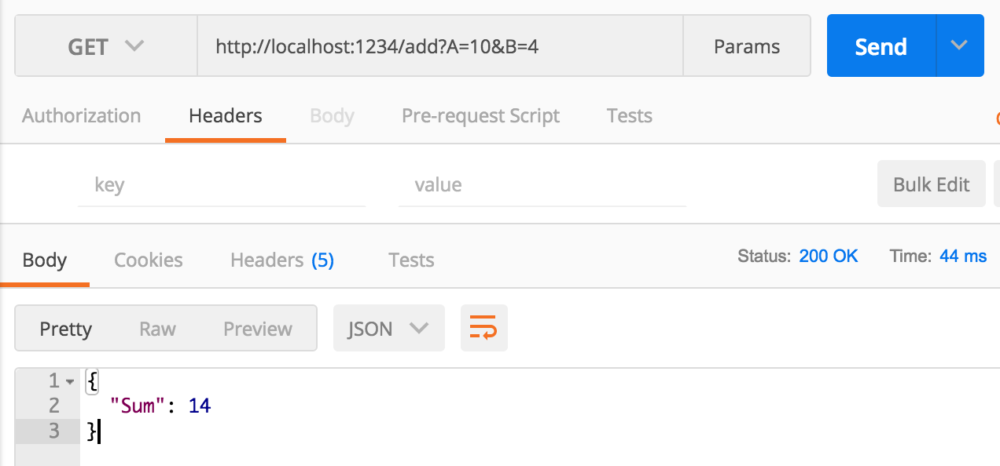

# Service Host
If you want to make some functionality coded in a .NET language easily available via HTTP, Service Host is here to help.
You just have to be able to conform to a very simple service contract.

## Defining a Service
Let's assume you want to publish this via HTTP:
```
class SimpleMath {
    public int Add(int a, int b) { return a + b; }
}
```
With Service Host you'd write a small wrapper class, a service:
```
using System.Web.Script.Serialization; // from System.Web.Extensions.dll
using servicehost.contract;

[Service]
public class SimpleService
{
    [EntryPoint(HttpMethods.Get, "/add", InputSources.Querystring)]
    public string Add(string input) {
        var json = new JavaScriptSerializer();
        AddRequest req = json.Deserialize<AddRequest>(input);

        var simplemath = new SimpleMath();
        var sum = simplemath.Add(req.A, req.B);

        var result = new AddResult { Sum = sum };
        return json.Serialize(result);
    }
}
```
The class is labeled as a service by putting the `[Service]` attribute on it.
This attribute like the others is defined in `servicehost.contract.dll` which you need to reference from your service assembly.

Public methods you want to make accessible via HTTP as a service then need to be labeled as entry points, again with an attribute.
Each entry point states the HTTP method to use (e.g. `GET`) and a route, e.g. `/add`. Also it needs to tell Service Host where it expects any
input data to come from. Either choose the URL query string (like above) or the HTTP payload (the default). In any case input data is
delivered as a JSON string. Output data needs also needs to be returned as a JSON string. It's supposed to be simple service hosting, right?

In the example above .NET's own JSON (de)serialiser is used from the `System.Web.Extensions` assembly. It parses the incoming data into
an `AddRequest` object and nicely serialises the result object. Between clients and service the JSON contract is looking like this:
```
// input
{
  "A": 4,
  "B": 3
}

// output
{
  "Sum": 7
}
```
The respective message classes for the service are straightforward:
```
public class AddRequest {
    public int A { get; set; }
    public int B { get; set; }
}

public class AddResult {
    public int Sum { get; set; }
}
```

## Hosting a Service
Once you have set up an assembly with the service class and the actual functionality to publish, e.g. `demoservice.dll`, you put them in the same directory as the Service Host, e.g.
```
demoservice.dll
demoservice.dll.mdb
servicehost.contract.dll
servicehost.contract.dll.mdb
servicehost.exe
servicehost.exe.mdb
Nancy.dll
Nancy.Hosting.Self.dll
```
This is enough for the Service Host to find your service upon start, e.g.
```
mono servicehost.exe http://localhost:1234
```
In fact Service Host will search all assemblies with the extension `.dll` in its directory for annotated types like above and publish them at the routes given.

### Testing a Service
To call the service you can use curl:
```
$ curl http://localhost:1234/add?A=10&B=4
{"Sum":14}
$
```
(Please note: Maybe you have to escape the `&` with a `\` or some other character.)

Or you use a tool like [Postman](https://www.getpostman.com):



---

So much for a first impression of Service Host. If you want to learn more, check out the [reference](doc/reference.md) page.

### Deploy a Service

To deploy the service to the cloud with [dropstack](https://dropstack.run) just enter:

#### Setup

```bash
npm i -g dropstack-cli
```

#### Login

```bash
dropstack login
```

#### Build & Deploy

> For [Mono .Net-Framework](http://www.mono-project.com/) applications [dropstack](https://dropstack.run) tries to find a [build.sh](src/servicehost/build.sh) and [start.sh](src/servicehost/start.sh)

```bash
cd src/servicehost
dropstack deploy
```